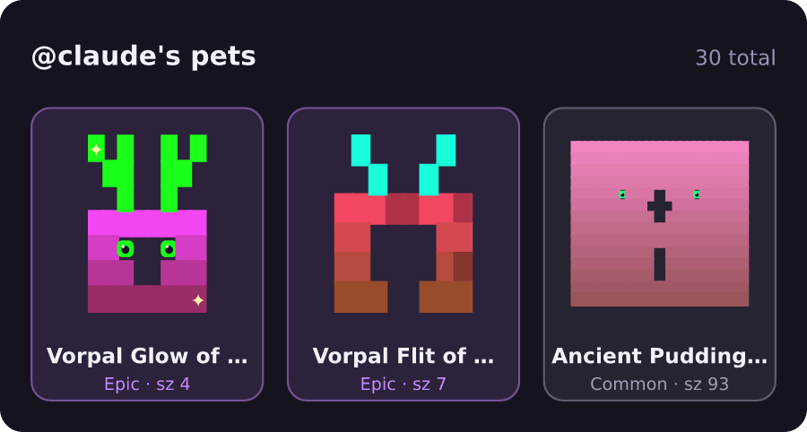
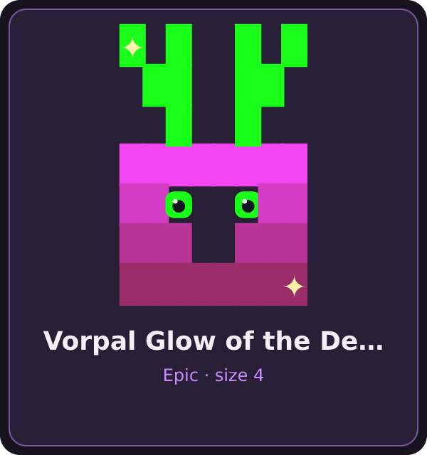

# Renown — for VS Code

Earn [**renown**](https://github.com/absolutejs/renown) for real dev work — a live HUD, activity-driven sync, and your 1/1 pets, right in your editor.

<p align="center">
  
</p>

Renown turns your verified GitHub contributions into a score, levels, and procedurally-generated **1/1 pets** — each one minted from a real commit, so no two are alike. This extension brings that to where you already work.

---

## What it does

- **🔥 Status bar HUD** — your live renown (score + this-week delta), with total level and pet count in the tooltip. Signed in with GitHub, so the identity is *proven*, not typed.
- **🫀 Activity-driven sync** — while you actively edit a repo, after a few minutes of work it asks the renown server to **recompute** your renown for that repo from your real GitHub commits (the same path as the `renown ci-sync` Action). A subtle spinner shows when it's syncing; a per-repo cooldown keeps it from re-running while you keep typing.
- **🐾 Sidebar panel** — your badge, this week's recap, your **pet roster**, this repo's leaderboard, and the achievements you unlocked this week.
- **🎉 New-pet celebration** — when a sync mints a new 1/1, the actual creature pops up (gently animated). Earning a pet is a *moment*, not a counter ticking up.

> **Editing only *triggers* a refresh — it never sets your score.** Everything is recomputed server-side from your GitHub-verified activity. The extension is a pure client; it can't inflate anything. See the [trust model](https://github.com/absolutejs/renown/blob/main/docs/trust-model.md).

<p align="center">
  
  &nbsp;&nbsp;
  
</p>

---

## Getting started

1. **Install** (from source, until the Marketplace listing is live):
   ```bash
   git clone https://github.com/absolutejs/renown-vscode-extension
   cd renown-vscode-extension
   bun install && bun run build
   ```
   Then open the folder in VS Code and press **F5** to launch the Extension Development Host.
2. **Sign in** — run **`Renown: Sign in with GitHub`** (or click *Renown: sign in* in the status bar). This uses VS Code's built-in GitHub auth — no separate account, no token to paste.
3. **Point it at a renown server** — set **`renown.endpoint`** to your server's API base. During local development that's `http://localhost:7777/api` against a `bun run start` in [`renown/web`](https://github.com/absolutejs/renown). *(Once renown is hosted, this defaults to the hosted URL and won't need setting.)*

That's it — the HUD lights up, and editing a repo starts earning renown.

---

## Commands

| Command | What it does |
| --- | --- |
| **Renown: Sign in with GitHub** | Authenticate via VS Code's GitHub provider (proven identity). |
| **Renown: Sync This Repo Now** | Recompute your renown for the active repo immediately. |
| **Renown: Preview New Pet** | Open the celebration with your signature pet — no commit needed (handy for a look). |
| **Renown: Open My Profile** | Open your public renown profile in the browser. |
| **Renown: Refresh Panel** | Re-fetch the sidebar panel. |
| **Renown: Set GitHub Login (manual)** | Override the identity (self-hosted / view-as). |
| **Renown: Open Settings** | Jump to the renown settings. |

## Settings

| Setting | Default | Description |
| --- | --- | --- |
| `renown.endpoint` | `""` | Your renown server's API base URL. |
| `renown.login` | `""` | Optional identity override. Normally blank — the signed-in GitHub identity is used. |
| `renown.heartbeatMinutes` | `5` | Minutes of active editing in a repo before its renown is refreshed. |
| `renown.statusRefreshSeconds` | `90` | How often the status bar re-fetches your renown. |

---

## How the sync works

```
you edit files  →  N minutes of activity in a repo  →  extension asks the server to recompute
                                                         │
                                   server scores your real GitHub commits (its own token,
                                   the shared craft formula) and updates your verified renown
                                                         │
                          status bar + panel refresh  ·  any new 1/1 pets are celebrated
```

The extension sends no scores — only "please recompute @me / this repo." The server is the sole source of truth, and it only ever reads GitHub-verified data.

---

## Requirements

- A reachable **renown server** (`renown.endpoint`). There's no hosted endpoint yet — run one locally with [`renown/web`](https://github.com/absolutejs/renown) (`bun run start` → `http://localhost:7777/api`).
- VS Code **1.85+** and the built-in GitHub authentication provider.

## License

[BSL-1.1](LICENSE) — see the repo's license for terms. Not affiliated with `@absolutejs/absolutejs-vscode-extension`; this is the renown product's own extension.
